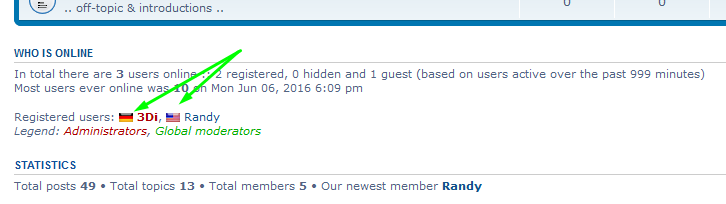
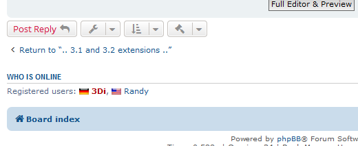
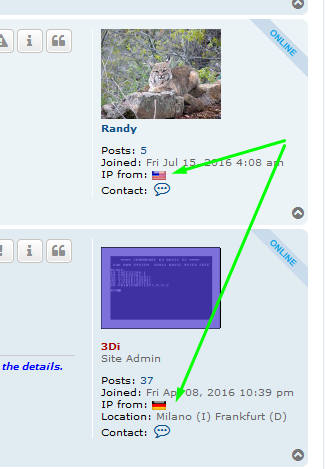
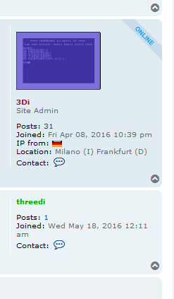

# IP Country Flag (a sort of Country Flags Invasion)

Master brach status:  

IP Country Flag is an extension that requires at least phpBB version 3.1.9, works also on 3.2.x.
This is a port of the MOD I made first for phpBB2 and Categories Hierarchy MOD, then for phpBB3 (Olympus).

Use of cURL is mandatory. 
This ext uses the GeoLocation API: http://freegeoip.net (support IPv4 and IPv6)
See also https://en.wikipedia.org/wiki/ISO_3166-2 for the Country Codes values

Online list on index screenshot

Viewtopic online list screenshot

Viewtopic's mini-profile screenshot, once Users are logged in

Viewtopic's mini-profile screenshot, once Users are logged in and out

